# Monte Carlo Statistical Methods


A complete reconstruction of the **Monte Carlo Statistical Methods** framework, implemented from scratch with clean visualizations, diagnostics, and mathematical writeups.  
This repository builds intuition for the numerical engines behind **Bayesian inference, probabilistic robotics, and reinforcement learning**: sampling, importance sampling, variance reduction, Brownian motion, and advanced MCMC (MH, AM, DR, DRAM).

Everything is designed for clarity and insight, from foundational sampling methods to high-dimensional MCMC behavior on nonlinear targets.

---

# DRAM on a Banana Distribution

<p align="center">
  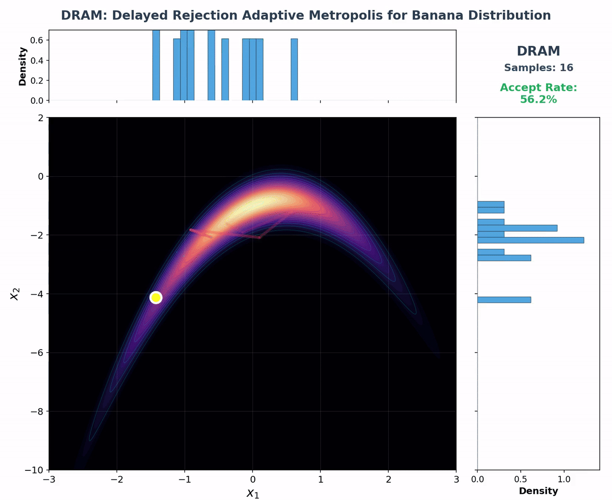
</p>

**Delayed Rejection Adaptive Metropolis sampling a nonlinear banana-shaped target.**  
This illustrates two-stage proposals, covariance adaptation, and real mixing behavior on warped geometries that appear in Bayesian robotics and RL when posterior surfaces are highly nonlinear.

---

# Overview

This repository develops Monte Carlo techniques from first principles with a focus on:

### **Sampling**
- Inverse Transform  
- Accept–Reject  
- Exponential, Gamma, Logistic, Laplace sampling  

### **Monte Carlo Estimation**
- WLLN, SLLN, CLT  
- Empirical versus theoretical convergence  

### **Importance Sampling**
- Weight behavior  
- Tail mismatch  
- Rare-event estimation  
- Self-normalized IS  

### **Variance Reduction**
- Control variates  
- Brownian motion scaling  

### **Markov Chain Monte Carlo**
- Metropolis–Hastings  
- Adaptive Metropolis  
- Delayed Rejection  
- Delayed Rejection Adaptive Metropolis (DRAM)

### **Diagnostics**
- Burn-in  
- Autocorrelation  
- Integrated autocorrelation time  
- Effective sample size (ESS)  
- Mixing behavior  

Each method includes animations, intuitive diagrams, code, and full mathematical analysis.

---

# Sampling Visualizations

### **Inverse Transform Sampling for Beta Distribution**
Transforms uniform draws \(U \sim \text{Unif}(0,1)\) through the inverse CDF \(F^{-1}(U)\) to generate exact Beta(10,3) samples.

<p align="center">
  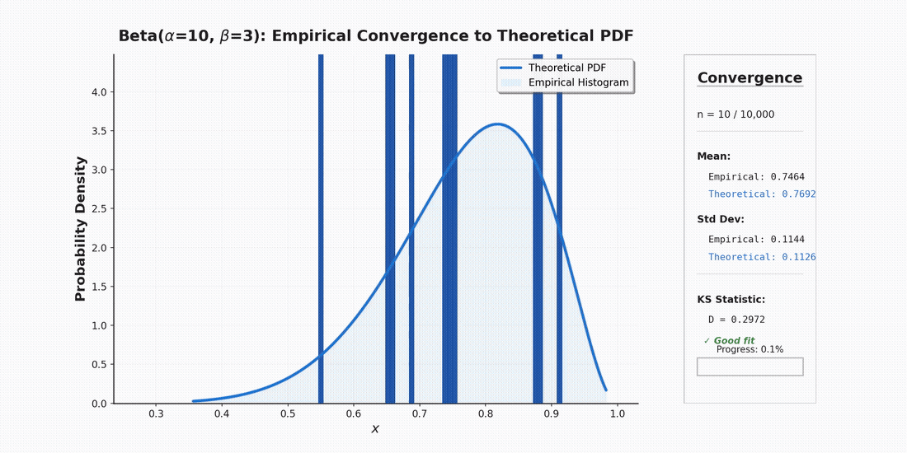
</p>

---

### **Accept–Reject Sampling (Gaussian Target, Laplace Proposal)**
Illustrates proposal mismatch, acceptance behavior, and envelope geometry.

<p align="center">
  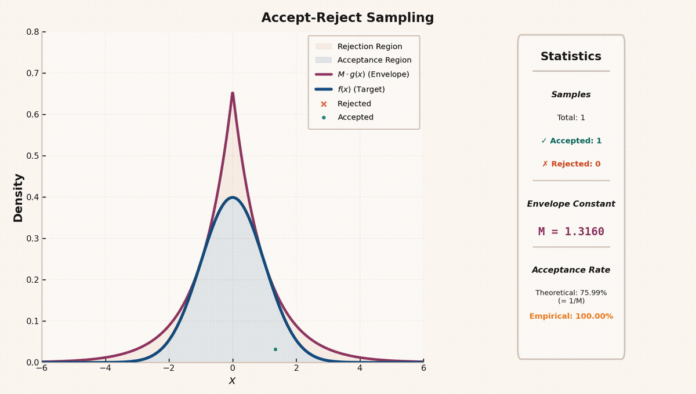
</p>

---

# Importance Sampling

<div style="display: flex; justify-content: space-between; width: 100%;">
  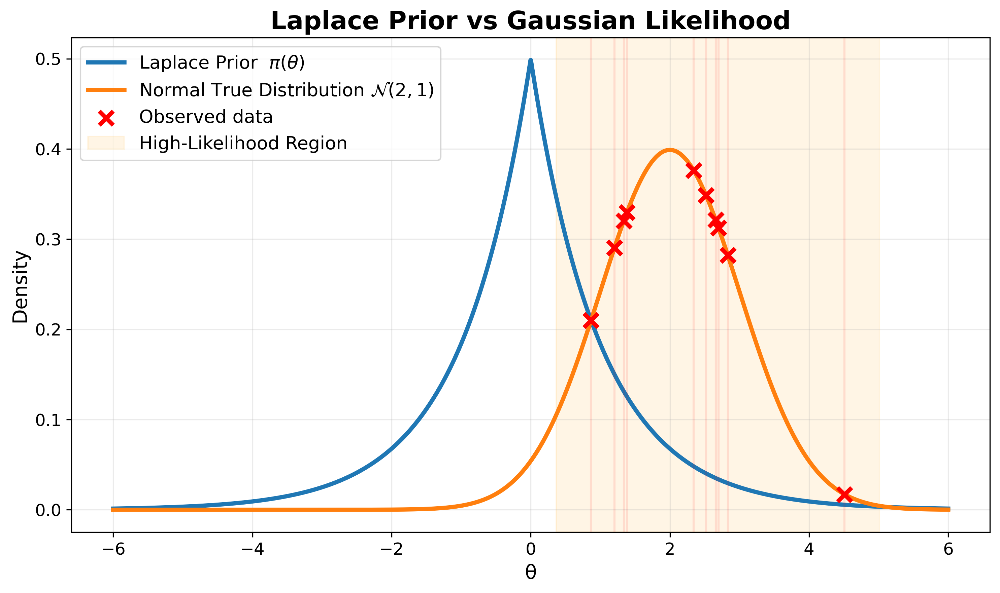
  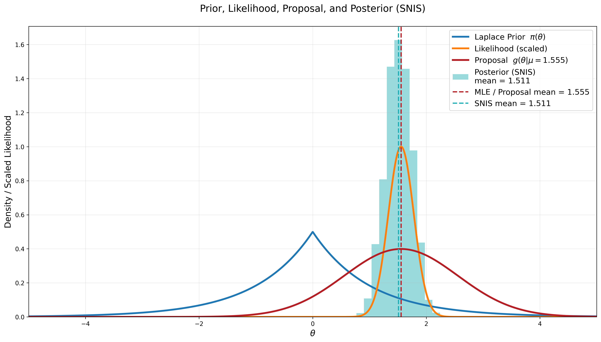
</div>

Importance sampling is developed from basic motivation to full diagnostics, including weight stability, heavy-tail mismatch, and rare-event estimation.

---

# Control Variates

<div align="center">
  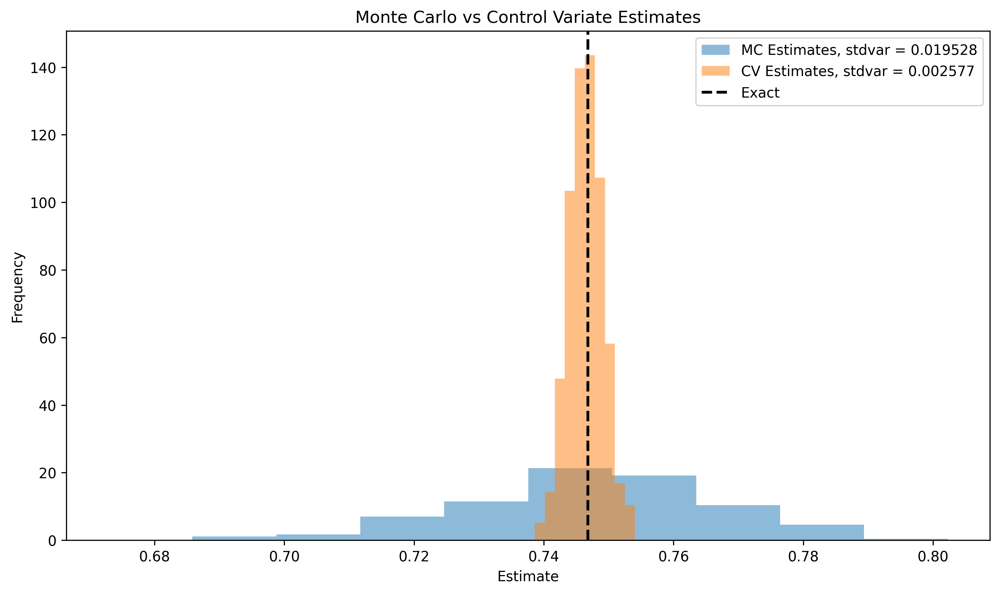
  
</div>

Demonstrates how correlation structure can significantly reduce estimator variance.

---

# Brownian Motion

<div align="center">
  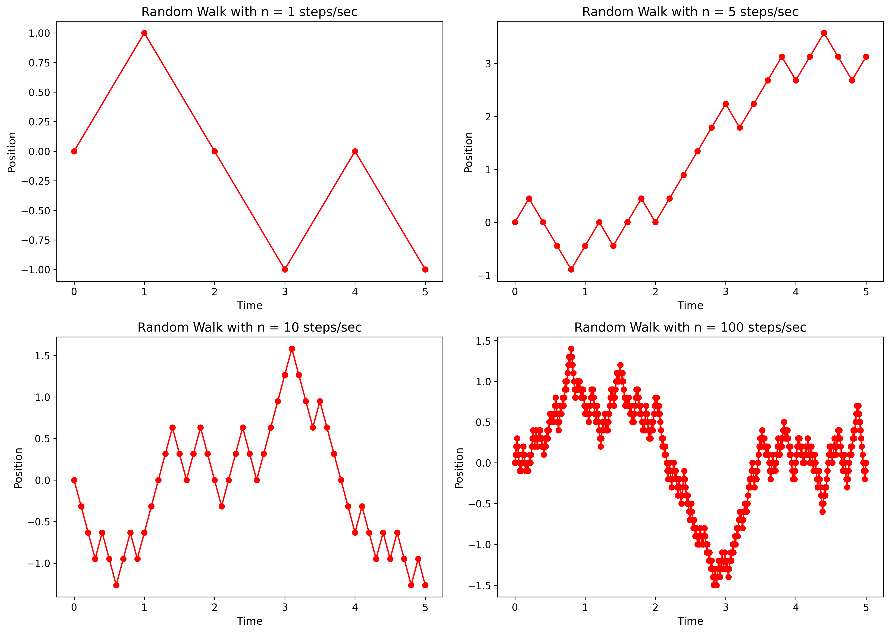
  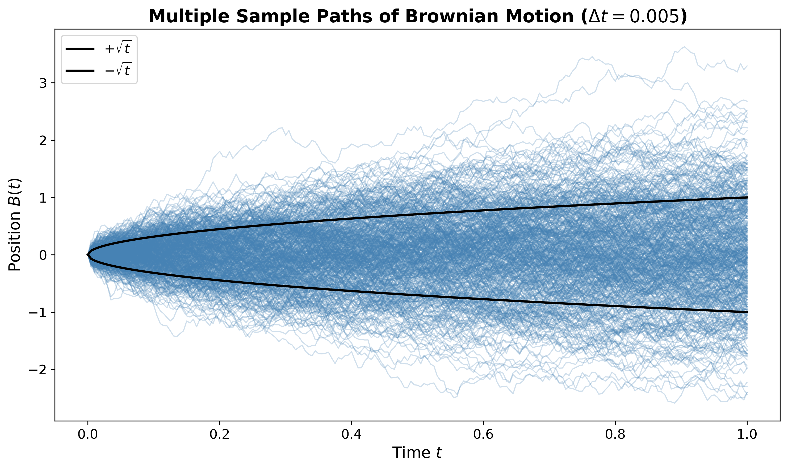
</div>

From the scaling limit of random walks to full Brownian-motion sample paths.

---

# MCMC Gallery

Full implementations of:

- Metropolis–Hastings  
- Adaptive Metropolis  
- Delayed Rejection  
- DRAM  

Applied to Gaussian and banana-shaped targets.  
Includes Laplace initialization, covariance adaptation, mixing behavior, autocorrelation diagnostics, and ESS analysis.

<div align="center">
  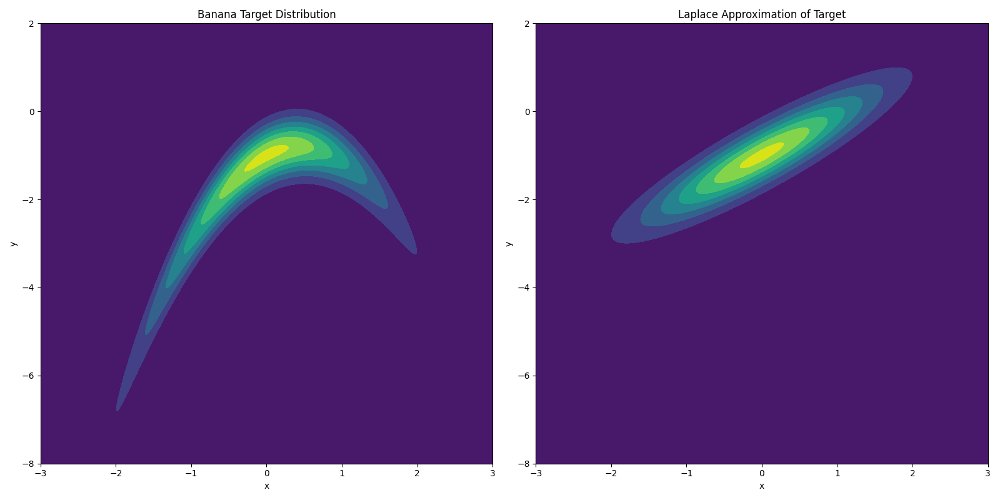
  <br>
  <i>Laplace approximation guiding initialization.</i>
</div>

<div align="center">
  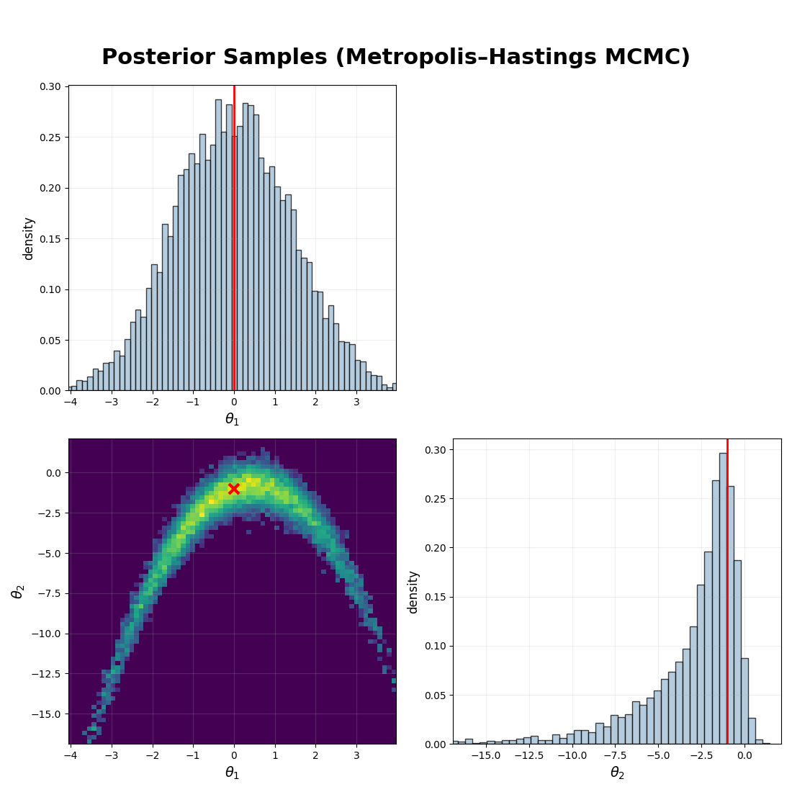
</div>

<div align="center">
  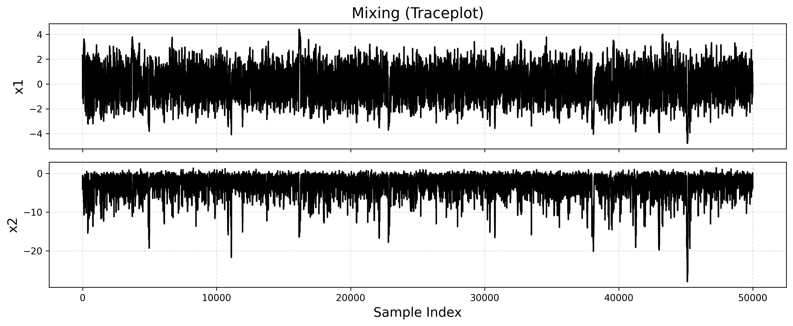
  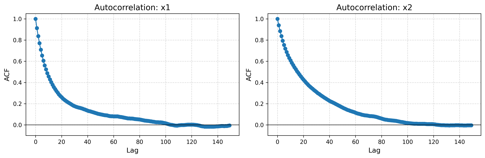
</div>

---

# Notebook Gallery

### **Sampling**
- ch02_general_transforms.ipynb  
- ch02_accept_reject.ipynb  
- exponential.ipynb  
- gamma.ipynb  

### **Importance Sampling**
- Cauchy tail motivation  
- Rare-event estimation  
- Self-normalized IS  

### **Variance Reduction**
- Control variates example  

### **Stochastic Processes**
- Brownian motion  

### **MCMC**
- MH diagnostics  
- Adaptive Metropolis (Gaussian and Banana)  
- Delayed Rejection  
- DRAM  

---

# PDF Chapter Library

Mathematical writeups include:

- Sampling transformations  
- Accept–Reject  
- Importance Sampling  
- Variance Reduction  
- Brownian Motion  
- Markov Chains  
- Metropolis–Hastings  

Written in a clean lecture-note style with derivations, proofs, and intuition.

---

# Project Structure

```text
MonteCarlo-Statistical-Methods/
│
├── animations/              # GIF/MP4 animations for visualizations
├── images/                  # Figures for diagnostics and analysis
├── notebooks/               # Jupyter notebooks for each chapter
├── reports/                 # Mathematical PDF writeups
├── src/                     # Full code implementation
│   ├── sampling
│   ├── importance_sampling
│   ├── variance_reduction
│   ├── mcmc
│   ├── stochastic_processes
│   └── utils
└── README.md

````
---

# About Me

I study and implement methods in **optimization, control, robotics, Bayesian inference, and probabilistic reasoning**.

* GitHub: [https://github.com/SaiSampathKedari](https://github.com/SaiSampathKedari)
* LinkedIn: [https://linkedin.com/in/sai-sampath-kedari](https://linkedin.com/in/sai-sampath-kedari)
* X: [https://x.com/SSampathKedari](https://x.com/SSampathKedari)
* Email: [sampath@umich.edu](mailto:sampath@umich.edu)
