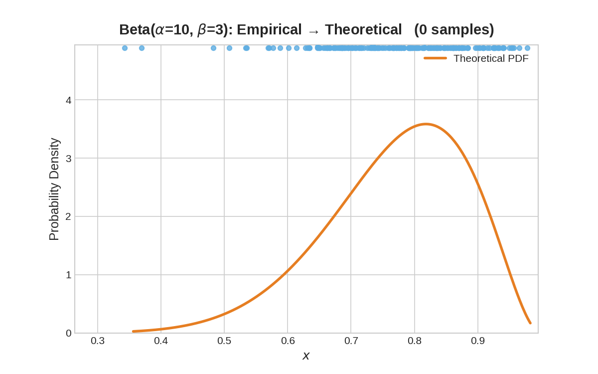
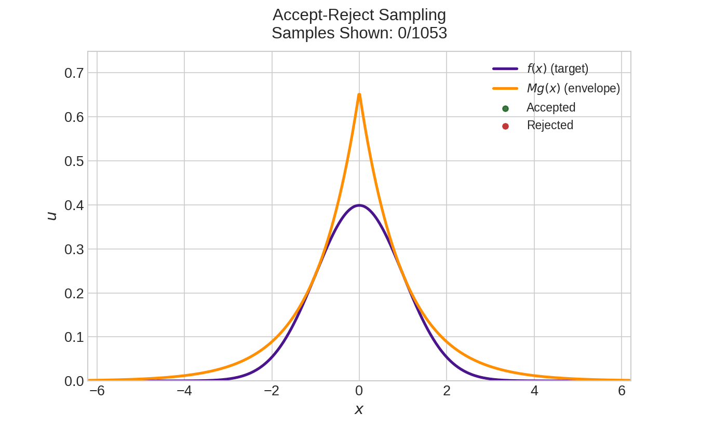
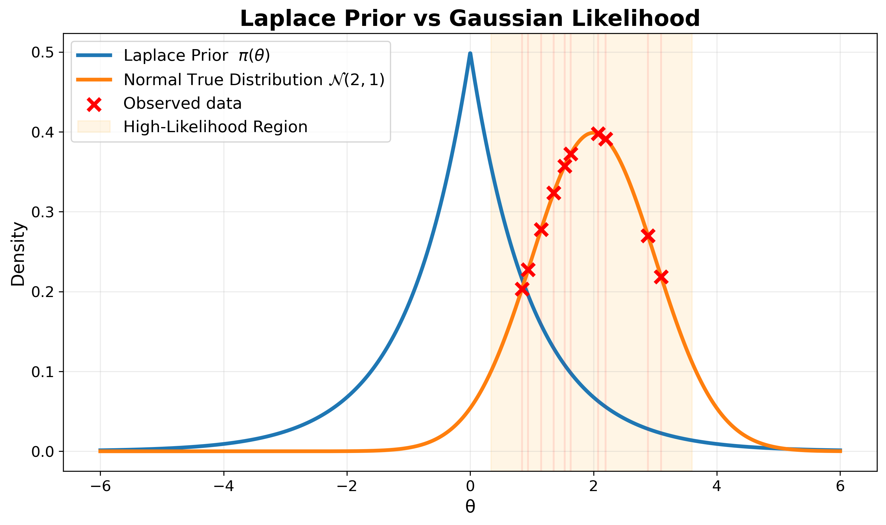
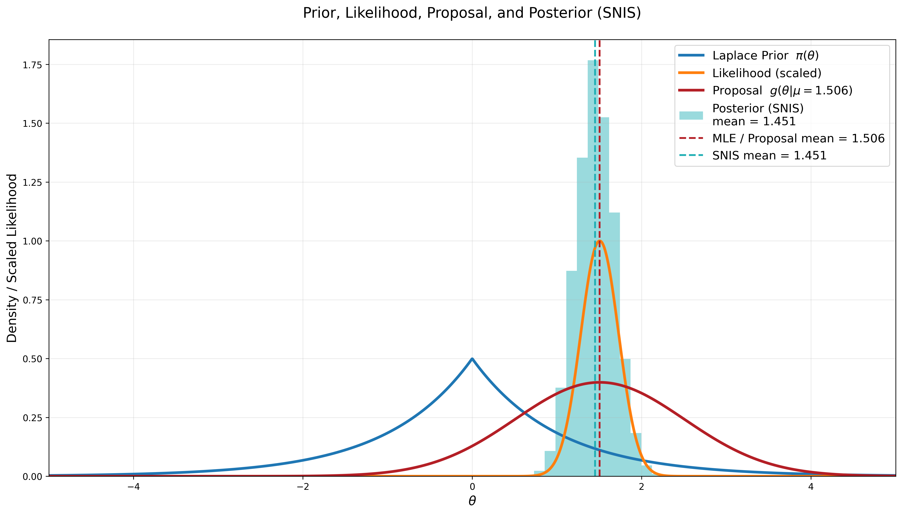
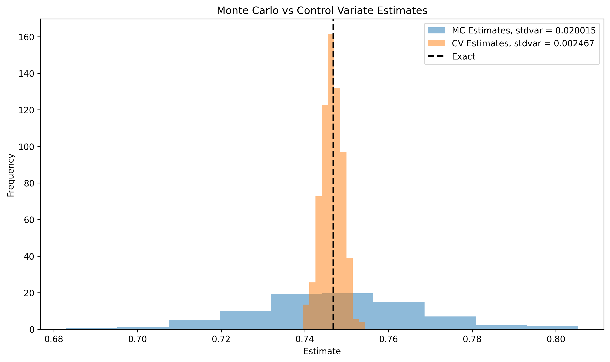
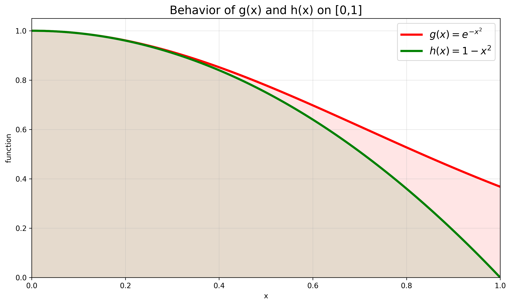
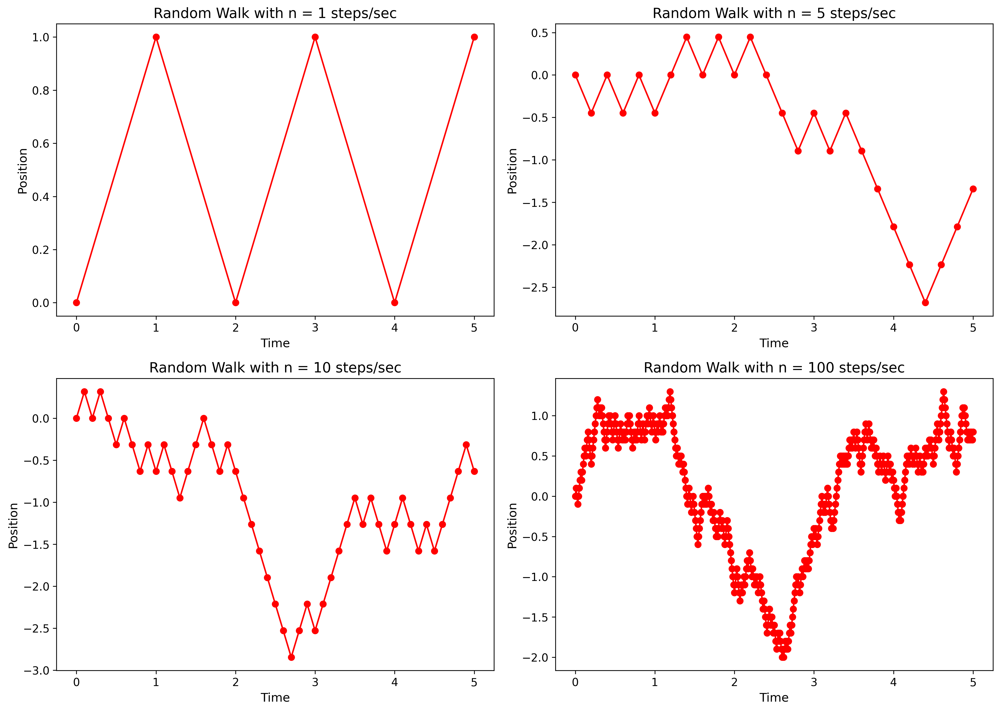
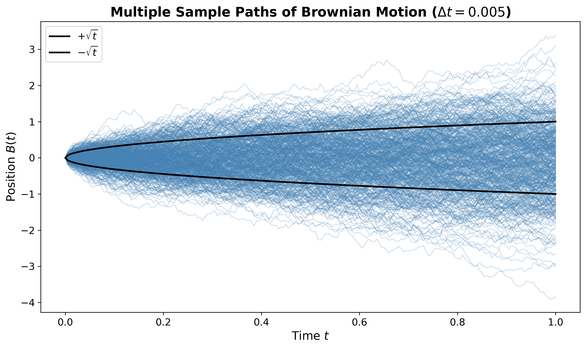

# MonteCarlo-Statistical-Methods

This repository includes step-by-step implementations and visualizations of key Monte Carlo techniques:

1. Random variable generation (Inverse Transform, Accept–Reject, Importance Sampling)  
2. Monte Carlo estimation and convergence (WLLN, SLLN, CLT)  
3. Variance reduction methods (Control Variates, Multilevel Control Variates)  
4. Markov Chain Monte Carlo (MCMC)  
5. Bayesian inference and filtering basics  
6. Applications to statistical estimation, learning, and robotics  

🚧 Work in progress — starting with fundamental sampling and convergence demos.

---

### 🎥 Sampling Visualizations

  
  &nbsp;&nbsp;&nbsp;
  

  <i>Inverse Transform Sampling (Beta distribution) &nbsp; | &nbsp; Accept–Reject Sampling (Laplace → Normal)</i>

---

### 📊 Importance Sampling & Self-Normalized Importance Sampling 

 
   
  &nbsp;&nbsp;&nbsp; 
   

 

 
  Visualizing the proposal distribution, likelihood weighting, and posterior formation in Importance Sampling and Self-Normalized Importance Sampling. 

---

### 🎚️ Control Variates

  
  &nbsp;&nbsp;&nbsp;
  

  Comparing vanilla Monte Carlo estimates with Control Variates (left), and visualizing how the chosen control variate 
  is strongly correlated with the target function (right). This correlation drives the variance reduction effect.

---

### 🟦 Brownian Motion: From Random Walks to Continuous Paths

  
  &nbsp;&nbsp;&nbsp;
  

  Constructing Brownian Motion from the diffusive scaling of simple random walks (left), and several Brownian 
  sample paths with the characteristic square-root growth of spread over time (right).

---
